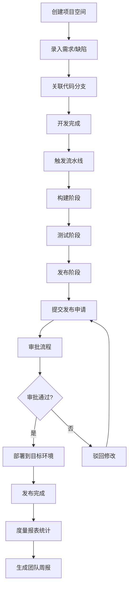
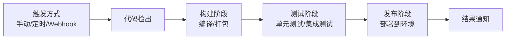

## 1. 产品概述

DevOps 平台是面向研发团队的一体化交付管理平台，覆盖从需求跟踪、代码构建、测试验证、环境部署到发布上线的完整软件交付生命周期。平台旨在提升研发效率、规范交付流程、降低发布风险，为团队提供可视化、可追溯、可度量的交付体验。

- 目标用户：研发工程师、测试工程师、运维工程师、项目经理、技术负责人
- 核心价值：统一交付入口、流程标准化、数据可视化、质量可度量

## 2. 核心功能

### 2.1 用户角色

| 角色 | 说明 | 核心权限 |
|------|------|----------|
| 研发工程师 | 代码开发与构建 | 创建需求、提交代码、触发流水线、查看日志 |
| 测试工程师 | 质量保障 | 管理缺陷、执行测试、验证发布 |
| 运维工程师 | 环境与发布管理 | 环境配置、发布审批、生产部署、回滚操作 |
| 项目经理 | 项目统筹 | 项目管理、进度跟踪、度量报表查看 |
| 管理员 | 平台管理 | 用户管理、权限配置、系统设置 |

### 2.2 功能模块

1. **项目首页**：项目概览、快速入口、交付数据统计、最近活动
2. **流水线**：流水线配置、构建/测试/发布阶段管理、执行日志、执行历史
3. **发布计划**：发布申请、审批流程、发布记录、回滚入口
4. **环境管理**：测试/预发/生产环境管理、环境状态、版本信息、资源配置
5. **问题追踪**：需求管理、缺陷管理、关联代码分支、状态流转
6. **度量报表**：交付周期、发布频率、失败原因统计、团队周报

### 2.3 页面详情

| 页面名称 | 模块名称 | 功能描述 |
|-----------|----------|----------|
| 项目首页 | 顶部概览卡片 | 展示项目数、流水线数、发布次数、缺陷数等关键指标 |
| 项目首页 | 快捷操作区 | 快速创建项目、触发流水线、提交发布申请 |
| 项目首页 | 交付趋势图 | 展示近30天发布频率、交付周期趋势 |
| 项目首页 | 最近活动列表 | 展示最近的流水线执行、发布记录、问题更新 |
| 流水线 | 流水线列表 | 展示所有流水线及其状态、最近执行时间 |
| 流水线 | 流水线详情 | 展示流水线配置、阶段步骤、执行历史 |
| 流水线 | 流水线配置 | 配置构建、测试、发布阶段，设置触发方式（手动/定时） |
| 流水线 | 执行日志 | 实时查看每一步执行日志和结果状态 |
| 发布计划 | 发布列表 | 展示所有发布计划及状态（待审批/进行中/已完成/已回滚） |
| 发布计划 | 发布申请 | 填写发布内容、关联需求、选择目标环境、提交审批 |
| 发布计划 | 审批流程 | 展示审批节点、审批意见、审批状态 |
| 发布计划 | 回滚入口 | 对已发布版本支持一键回滚操作 |
| 环境管理 | 环境概览 | 展示测试、预发、生产环境状态及当前版本 |
| 环境管理 | 环境详情 | 查看环境配置、资源信息、部署历史 |
| 问题追踪 | 需求列表 | 需求的增删改查、状态流转、优先级管理 |
| 问题追踪 | 缺陷列表 | 缺陷的增删改查、严重程度、关联流水线 |
| 问题追踪 | 代码分支关联 | 将需求/缺陷与代码分支关联 |
| 度量报表 | 交付周期 | 展示需求从创建到上线的平均周期及趋势 |
| 度量报表 | 发布频率 | 按周/月统计发布次数及成功率 |
| 度量报表 | 失败原因 | 汇总流水线失败、发布失败的原因分类统计 |
| 度量报表 | 团队周报 | 按团队维度生成本周交付数据汇总报告 |

## 3. 核心流程

### 3.1 软件交付主流程

用户创建项目空间后，在问题追踪中录入需求和缺陷，开发人员关联代码分支进行开发。开发完成后触发流水线，依次执行构建、测试、发布阶段，每一步都可查看详细日志。测试通过后提交发布申请，经过审批流程后部署到对应环境。发布后可通过度量报表查看交付数据，支持按团队生成周报。

### 3.2 流水线执行流程

## 4. 用户界面设计

### 4.1 设计风格

- **设计理念**：科技感、专业、高效的企业级平台风格
- **主色调**：深空蓝 (#0F172A) 作为主背景色，搭配电光蓝 (#3B82F6) 作为主色调
- **辅助色**：成功绿 (#10B981)、警告橙 (#F59E0B)、危险红 (#EF4444)、信息青 (#06B6D4)
- **字体**：使用 JetBrains Mono 作为代码和数据展示字体，Inter 作为界面字体
- **布局风格**：左侧导航 + 顶部栏 + 内容区的经典后台布局，采用卡片式内容组织
- **图标风格**：使用 lucide-react 线性图标，简洁现代
- **动效**：页面切换使用淡入过渡，卡片悬停有轻微上浮和阴影加深效果

### 4.2 页面设计概览

| 页面名称 | 模块名称 | UI 元素 |
|-----------|----------|---------|
| 项目首页 | 概览卡片 | 渐变背景卡片、图标+数字组合、趋势指标 |
| 项目首页 | 趋势图表 | 面积图、折线图，带有数据点悬停提示 |
| 项目首页 | 活动列表 | 时间轴样式、状态标签、用户头像 |
| 流水线 | 流水线卡片 | 状态指示灯、进度条、最近执行时间 |
| 流水线 | 执行详情 | 阶段步骤垂直时间轴、可折叠日志面板 |
| 发布计划 | 发布卡片 | 状态徽章、环境标签、审批进度条 |
| 环境管理 | 环境卡片 | 环境状态灯、版本号、资源使用进度条 |
| 问题追踪 | 列表视图 | 表格 + 筛选器、状态标签、优先级标识 |
| 度量报表 | 图表区 | 柱状图、饼图、折线图组合展示 |

### 4.3 响应式设计

- 采用桌面优先设计，针对 1440px 及以上宽度优化
- 平板端（1024px）：侧边栏可收起，内容区自适应
- 移动端（768px以下）：顶部导航变为汉堡菜单，卡片堆叠展示
- 表格类组件支持横向滚动查看

### 4.4 动效与交互

- 页面加载：内容区淡入（fade-in），卡片错落出现（staggered animation）
- 状态变化：状态切换时有平滑的颜色过渡动画
- 流水线执行：步骤状态变化有脉冲动画，模拟实时执行感
- 悬停效果：可点击元素有背景色变化和轻微缩放
- 滚动：长列表使用虚拟滚动优化性能
