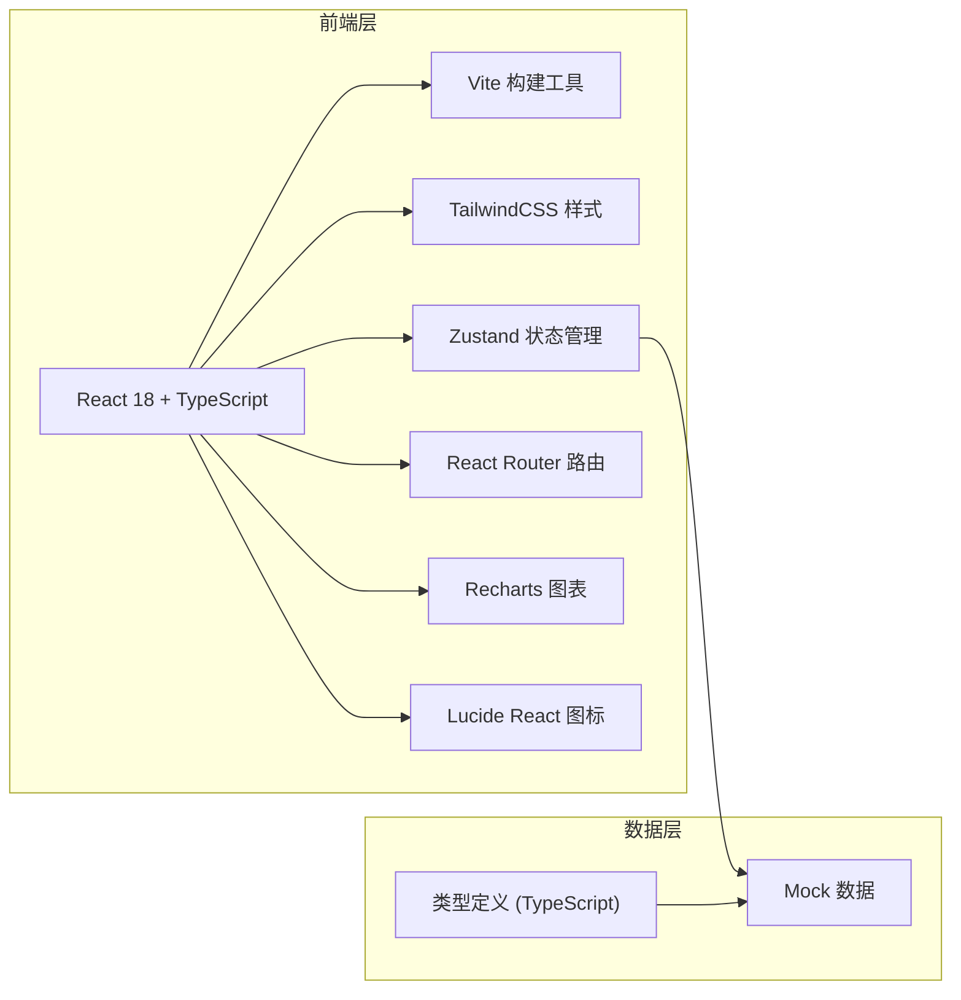

## 1. 架构设计



## 2. 技术描述

- **前端框架**：React 18 + TypeScript
- **构建工具**：Vite 5
- **样式方案**：TailwindCSS 3
- **状态管理**：Zustand
- **路由管理**：React Router DOM 6
- **图表库**：Recharts
- **图标库**：Lucide React
- **后端**：无后端，使用 Mock 数据模拟
- **数据存储**：前端状态管理 + LocalStorage 持久化

## 3. 路由定义

| 路由 | 页面 | 说明 |
|------|------|------|
| /dashboard | 项目首页 | 平台概览仪表盘 |
| /pipelines | 流水线 | 流水线列表与管理 |
| /pipelines/:id | 流水线详情 | 流水线执行详情与日志 |
| /releases | 发布计划 | 发布申请与审批管理 |
| /environments | 环境管理 | 多环境状态与配置 |
| /issues | 问题追踪 | 需求与缺陷管理 |
| /metrics | 度量报表 | 数据统计与周报 |

## 4. 核心数据模型

### 4.1 类型定义

```typescript
// 项目
interface Project {
  id: string;
  name: string;
  description: string;
  team: string;
  createdAt: string;
  status: 'active' | 'archived';
}

// 流水线
interface Pipeline {
  id: string;
  name: string;
  projectId: string;
  status: 'success' | 'failed' | 'running' | 'pending';
  stages: PipelineStage[];
  lastRunAt: string;
  triggerType: 'manual' | 'scheduled' | 'webhook';
}

// 流水线阶段
interface PipelineStage {
  id: string;
  name: string;
  status: 'success' | 'failed' | 'running' | 'pending';
  steps: PipelineStep[];
  duration: number;
}

// 流水线步骤
interface PipelineStep {
  id: string;
  name: string;
  status: 'success' | 'failed' | 'running' | 'pending';
  logs: string[];
  duration: number;
}

// 发布计划
interface Release {
  id: string;
  title: string;
  version: string;
  projectId: string;
  environment: 'test' | 'staging' | 'production';
  status: 'pending_approval' | 'approved' | 'deploying' | 'completed' | 'rollback' | 'rejected';
  applicant: string;
  approver?: string;
  approvalComments?: string;
  relatedIssues: string[];
  createdAt: string;
  deployedAt?: string;
}

// 环境
interface Environment {
  id: string;
  name: string;
  type: 'test' | 'staging' | 'production';
  status: 'healthy' | 'warning' | 'error';
  currentVersion: string;
  cpuUsage: number;
  memoryUsage: number;
  deployHistory: DeployRecord[];
}

// 部署记录
interface DeployRecord {
  id: string;
  version: string;
  deployedAt: string;
  deployedBy: string;
  status: 'success' | 'failed';
}

// 问题（需求/缺陷）
interface Issue {
  id: string;
  title: string;
  type: 'feature' | 'bug';
  status: 'backlog' | 'in_progress' | 'testing' | 'done' | 'closed';
  priority: 'low' | 'medium' | 'high' | 'critical';
  projectId: string;
  assignee: string;
  creator: string;
  branchName?: string;
  description: string;
  createdAt: string;
  updatedAt: string;
}

// 度量数据
interface MetricsData {
  deliveryCycle: {
    average: number;
    trend: { date: string; days: number }[];
  };
  releaseFrequency: {
    weekly: { week: string; count: number; success: number }[];
    monthly: { month: string; count: number; success: number }[];
  };
  failureReasons: {
    reason: string;
    count: number;
    percentage: number;
  }[];
  teamWeekly: {
    team: string;
    releases: number;
    issues: number;
    bugs: number;
    avgCycleTime: number;
  }[];
}
```

## 5. 项目结构

```
src/
├── components/          # 公共组件
│   ├── Layout/         # 布局组件
│   ├── Card/           # 卡片组件
│   ├── StatusBadge/    # 状态标签
│   ├── ProgressBar/    # 进度条
│   └── Chart/          # 图表组件
├── pages/              # 页面组件
│   ├── Dashboard/      # 项目首页
│   ├── Pipelines/      # 流水线
│   ├── Releases/       # 发布计划
│   ├── Environments/   # 环境管理
│   ├── Issues/         # 问题追踪
│   └── Metrics/        # 度量报表
├── store/              # 状态管理 (Zustand)
│   ├── useProjectStore.ts
│   ├── usePipelineStore.ts
│   ├── useReleaseStore.ts
│   ├── useEnvironmentStore.ts
│   ├── useIssueStore.ts
│   └── useMetricsStore.ts
├── data/               # Mock 数据
│   ├── projects.ts
│   ├── pipelines.ts
│   ├── releases.ts
│   ├── environments.ts
│   ├── issues.ts
│   └── metrics.ts
├── types/              # TypeScript 类型定义
│   └── index.ts
├── utils/              # 工具函数
│   ├── date.ts
│   └── format.ts
├── App.tsx
├── main.tsx
└── index.css
```

## 6. 状态管理设计

使用 Zustand 管理全局状态，按领域划分为多个 store：

- **useProjectStore**: 项目数据管理
- **usePipelineStore**: 流水线数据与执行状态
- **useReleaseStore**: 发布计划与审批数据
- **useEnvironmentStore**: 环境状态数据
- **useIssueStore**: 需求与缺陷数据
- **useMetricsStore**: 度量报表数据

每个 store 包含对应的数据、操作方法和选择器，支持数据的增删改查和状态更新。
